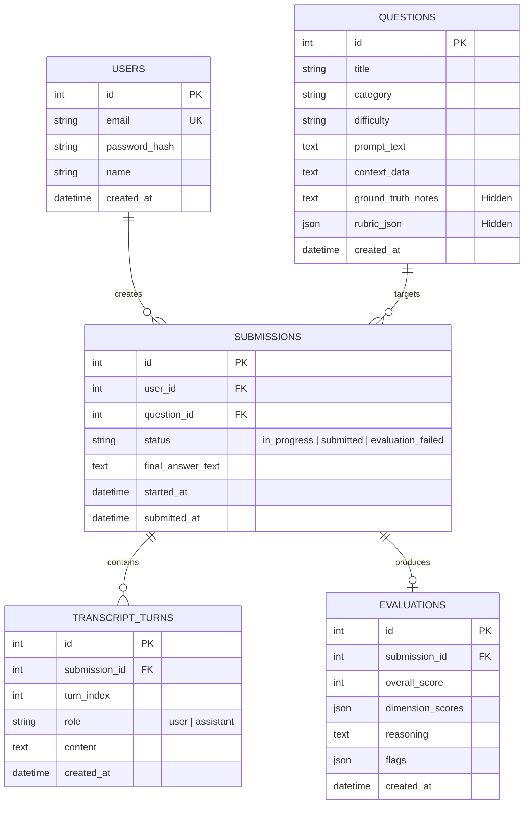

# Architecture Overview — PromptBench

PromptBench is an interactive benchmarking and training platform that evaluates a candidate's ability to collaborate effectively with AI assistants to solve complex, open-ended business problems.

---

## 1. Core Architectural Principle: Helper AI vs. Judge AI Isolation

A fundamental security and integrity requirement of PromptBench is the strict air-gap separation between the **candidate-facing assistant** and the **evaluator engine**.

```
┌─────────────────────────────────────────────────────────────────────────┐
│                           CANDIDATE INTERACTION                         │
└─────────────────────────────────────────────────────────────────────────┘
        │
        ▼
┌──────────────────┐       Chat Turns         ┌─────────────────────────┐
│  React Frontend  │ ◄──────────────────────► │  FastAPI Backend Router │
└──────────────────┘                          └───────────┬─────────────┘
                                                          │
                                     Public Case Context  │
                                                          ▼
                                              ┌─────────────────────────┐
                                              │    Helper AI Service    │
                                              │  (No rubrics / No notes)│
                                              └─────────────────────────┘

═════════════════════════════ SUBMISSION BOUNDARY ══════════════════════════

┌─────────────────────────────────────────────────────────────────────────┐
│                            GRADING ENGINE                               │
└─────────────────────────────────────────────────────────────────────────┘
                                                          │
                                     Final Answer +       │
                                     Full Transcript +    │
                                     Hidden Ground Truth +│
                                     Scoring Rubrics      ▼
                                              ┌─────────────────────────┐
                                              │    Judge AI Service     │
                                              │  (Server-Side Evaluator)│
                                              └───────────┬─────────────┘
                                                          │
                                         Validated JSON   ▼
                                              ┌─────────────────────────┐
                                              │   PostgreSQL Database   │
                                              └─────────────────────────┘
```

### Key Differences:

| Dimension | Helper AI (`candidate_llm.py`) | Judge AI (`judge_llm.py`) |
| :--- | :--- | :--- |
| **Audience** | Candidate in real-time chat | Automated grading pipeline |
| **Trigger** | Every message exchange | Final answer submission |
| **Visible Data** | Public case statement & conversation | Full transcript, final answer, hidden ground truth, rubric JSON |
| **Hidden Notes** | **Strictly Forbidden** (never sent) | Included for factual verification |
| **Rubric Access**| **Strictly Forbidden** | Included for multi-dimensional scoring |
| **Output Type** | Conversational Markdown | Strict, Pydantic-validated JSON |

---

## 2. Component Stack

- **Client Tier**: React 18 SPA built with Vite and Tailwind CSS. Axios handles JWT-authenticated HTTP requests with automatic bearer token injection.
- **API Tier**: Python FastAPI backend with modular routers (`auth`, `questions`, `submissions`, `evaluations`).
- **Data Tier**: PostgreSQL 1Relational database with SQLAlchemy 2.0 ORM.
- **AI Integration Tier**: Anthropic Claude API (`claude-3-5-sonnet-20241022`) for intelligent candidate assistance and structured rubric evaluation.

---

## 3. Data Models & Entity Relationships



---

## 4. Evaluation Dimensions & Anti-Gaming Heuristics

### Four Core Evaluated Dimensions:
1. **Clarifying Questions (25%)**: Did the candidate probe for missing business context, edge cases, and definitions before prescribing solutions?
2. **Iteration & Refinement (25%)**: Did the candidate push the AI helper deeper, challenge initial responses, and refine intermediate hypotheses?
3. **Hallucination Catching (25%)**: Did the candidate spot discrepancies, avoid blindly trusting misleading data, and ground findings in verified facts?
4. **Final Answer Quality (25%)**: Is the final synthesis structured, actionable, mathematically sound, and directly addressing business goals?

### Anti-Gaming Guardrails (`anti_gaming.py`):
- **Zero/Near-Zero Interaction**: Flags candidates submitting answers with zero or trivial chat history.
- **Instant Submissions**: Flags submissions made in under 30 seconds.
- **Copy-Paste Pre-Written Solutions**: Detects when a candidate pastes a massive pre-drafted text block directly into the chat prompt or final submission without real AI dialogue.
